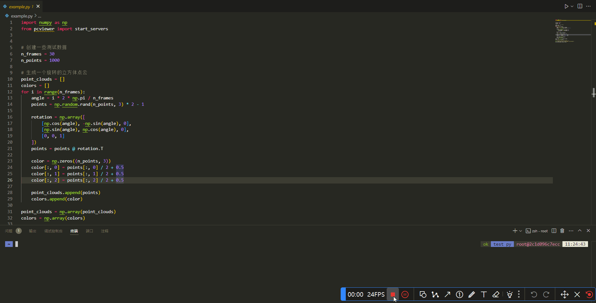

# PCViewer

PCViewer是一个简单易用的点云数据可视化工具，支持动态点云序列的实时渲染和交互式查看。

## 安装

```bash
pip install pcviewer
```

支持Python 3.7及以上版本。如果你使用conda环境，建议先创建新的环境：

```bash
conda create -n pcviewer python=3.9
conda activate pcviewer
pip install pcviewer
```

## 使用示例
只需将需要可视化的点云数据传入`start_servers`函数即可启动可视化服务器，然后在浏览器中访问`http://localhost:8080`来交互式查看点云数据。

```python
import numpy as np
from PCViewer import start_servers

# 创建示例点云数据
n_frames = 30
n_points = 1000

# 生成旋转的立方体点云
point_clouds = []
colors = []
for i in range(n_frames):
    angle = i * 2 * np.pi / n_frames
    points = np.random.rand(n_points, 3) * 2 - 1
    
    rotation = np.array([
        [np.cos(angle), -np.sin(angle), 0],
        [np.sin(angle), np.cos(angle), 0],
        [0, 0, 1]
    ])
    points = points @ rotation.T
    
    color = np.zeros((n_points, 3))
    color[:, 0] = points[:, 0] / 2 + 0.5
    color[:, 1] = points[:, 1] / 2 + 0.5
    color[:, 2] = points[:, 2] / 2 + 0.5
    
    point_clouds.append(points)
    colors.append(color)

# 启动可视化服务器
start_servers(np.array(point_clouds), np.array(colors))
```

### 参数说明

`start_servers(point_clouds, colors=None, show_axes=True, show_rings=True)`

- `point_clouds`: numpy数组或torch张量，形状为(n_frames, n_points, 3)，表示点云序列数据
- `colors`: numpy数组，形状为(n_frames, n_points, 3)，表示点云颜色，可选参数。各颜色通道值范围为[0, 1]，使用RGB格式
- `show_axes`: 布尔值，是否显示坐标轴，默认为True
- `show_rings`: 布尔值，是否显示辅助环，默认为True

## 运行效果


